# Wander-Travel-App
Node.js, Liquid-Express-Views, Express, CSS, MongoDb, .env, Bootstrap, and Mongoose will be used to create this app.

# User Story
User stories: (`As a user...`)
- Create/Post a Vacation Mood (2 routes in one!)
    - once user clicks certain mood, create the 
    - new schema
    - create a model to use
    - return newly created vacation mood
-View all Vacation Moods
    - query all moods in collection - find()
    - return all moods
- View single mood
    - query for single mood - findOne() .id / name?
    - return single correct mood
- Update/Post single vacation mood (2 routes in one!)
    - query for single mood in collection - .id / name?
    - update that single mood 
    - return updated mood
- Delete a single mood
    - query for single mood in collection - .id / name?
    - delete or remove a single mood
    - return a success of some kind
- Delete ALL moods
    - query for all moods in collection - .id
    - delete/remove ALL moods
    - return a success of some kind
-User login
    -query for a single username
    -query for a single password
    -return user to index page 

Schema: (model)
-Mood
    -Title - string
    -body - string
    -author - string
    -flight number - number - default value of 0 
    -Scheduled Flight - boolean - default value false
    -owner: {
        type: Schema.Types.ObjectId,//a single User ._id
        ref: 'User' // const User = model('User', userSchema)
        // the string of 'User' is how we reference a model
    },
    -comments: [] 

-User 
    -username: {
        type: String, 
        required: true,
        unique: true,
    }, 
    -password:{
        type: String, 
        required: true
    }

-Trip 
    -Title - String
    -BookingDate - String
    -BookingNumber - String
    -Provider - String
    -Description - String
    -Price- []
    -Start - []
    -End - []
    -Air- []

-Price 
    -Currency - String
    -Total - String
    -Base - String
    -TotalTaxes - String

-Start/ End
    -localDateTime - String
    -name - String
    -iataCode - String

-Air 
    -confirmationNumber - String
    -departureAirportLocation - []
    -arrivalAirportLocation - []
    -departure - []
    -arrival - []
    -aircraft - []
    -seats

-DepartureAirportLocation / ArrivalAirportLocation
    - description - String
    - name - String
   

-Departure 
    -description - String
    -iataCode - String
    -terminal - String
    -checkInEndTime - String
    -localDateTime - String

- Arrival
    -description - String
    -iataCode - String
    -terminal - String
    -localDateTime - String

-Seats
    - number - String
    - cabin - String

# Stretch Goals 
1. Incorporate a hotel function
2. Incorporate activities-near-by function
3. Incorporate Find-Cheapest-Flight search function
4. Incorporate Seat Map for flights

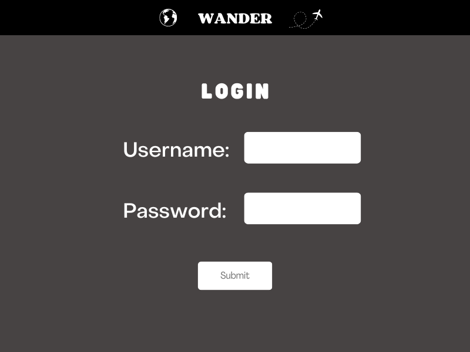
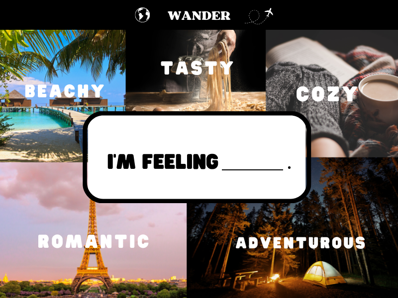
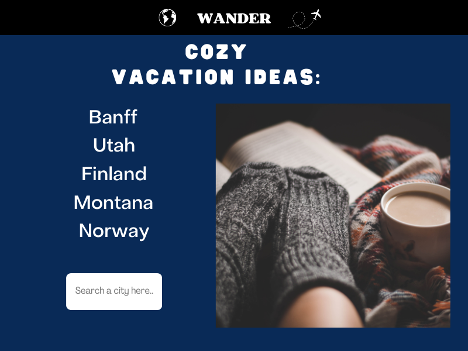

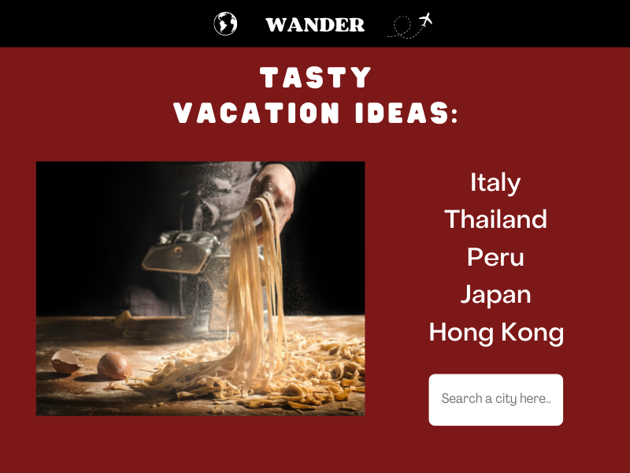
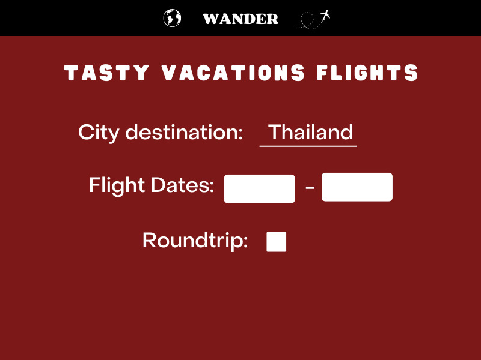
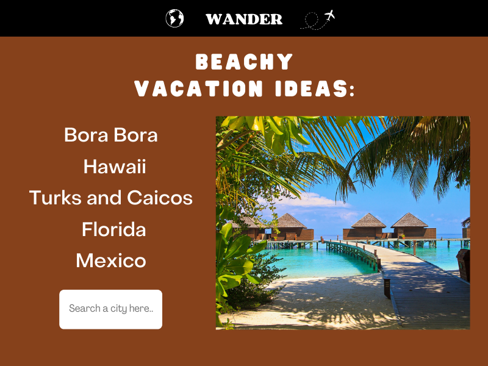
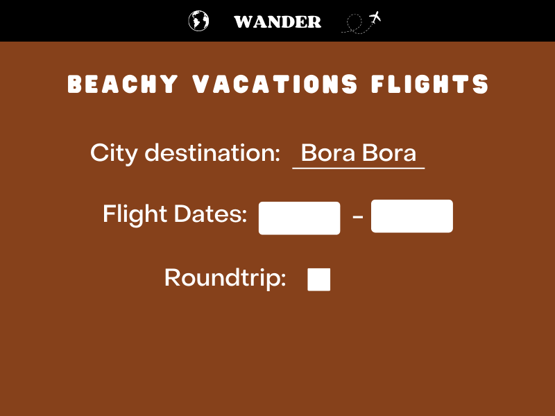
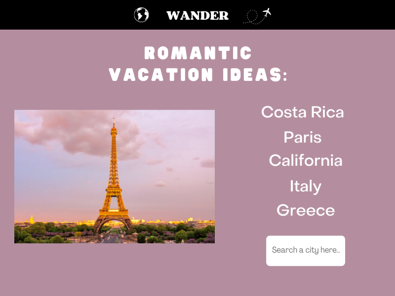
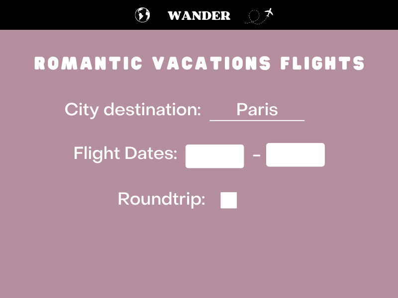
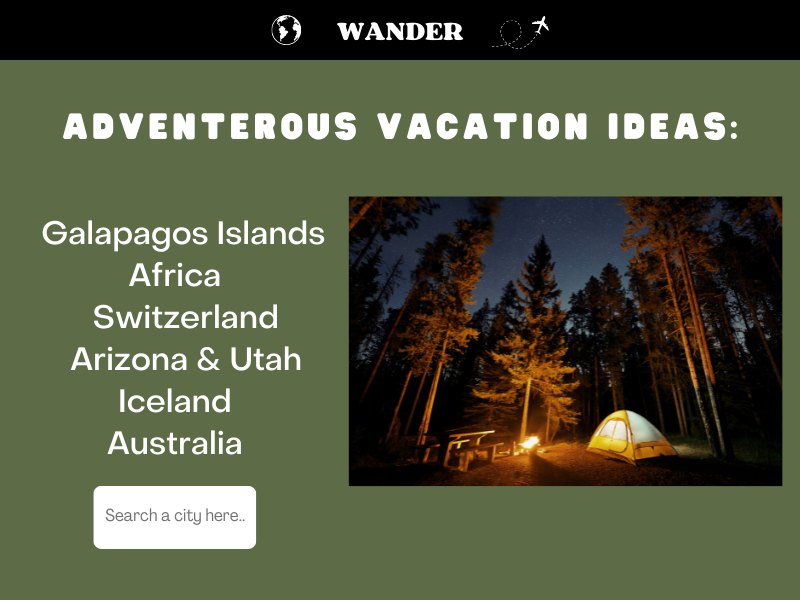
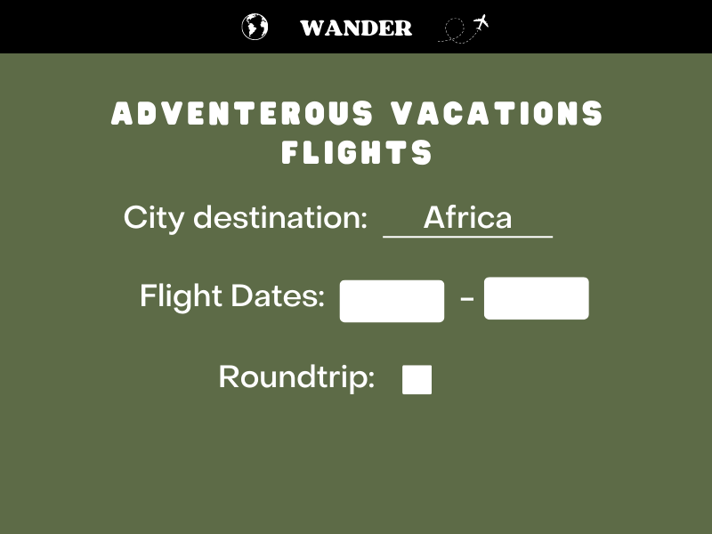
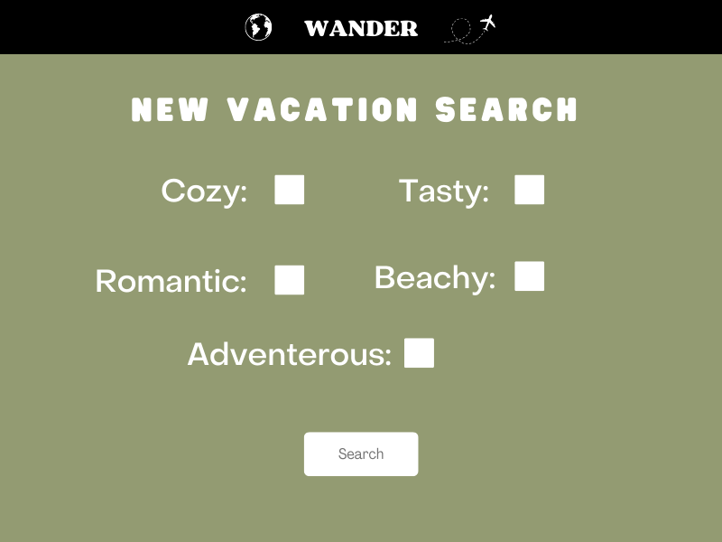
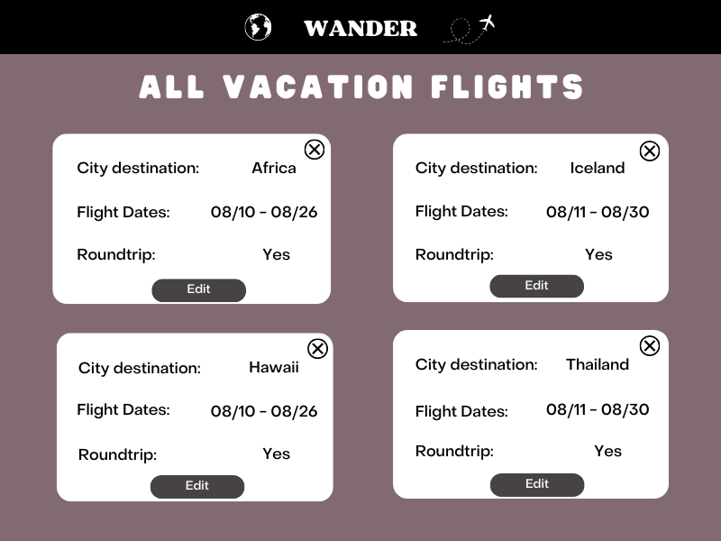