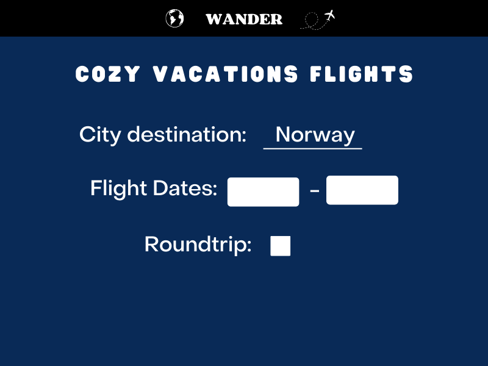
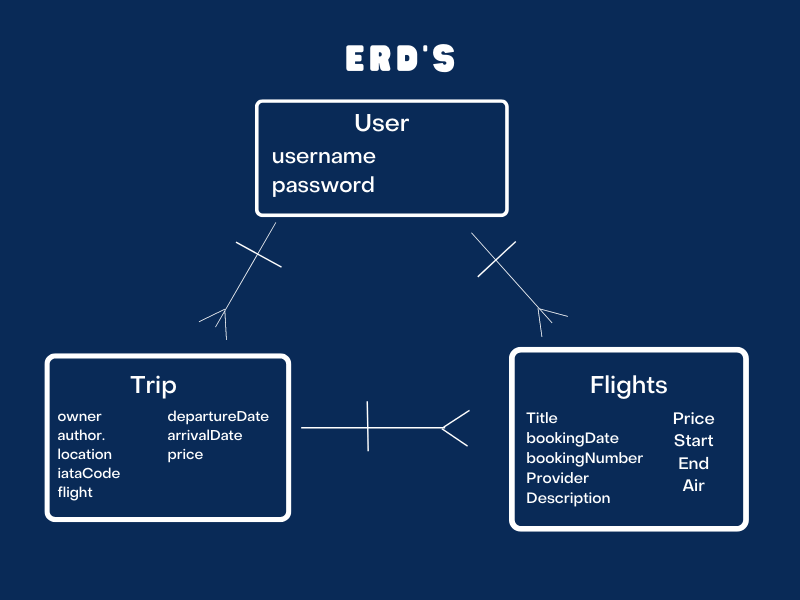

# Wander-Travel-App
Node.js, Liquid-Express-Views, Express, CSS, MongoDb, .env, Bootstrap, and Mongoose will be used to create this app.

# User Story
User stories: (`As a user...`)
- User login
    - query for a single username
    - query for a single password
    - return user to index page 
- View all Vacation Moods
    - query all moods in collection - find()
    - return all moods
- View single vacation mood
    - query for single mood - findOne() .id / name?
    - return single correct mood
- Browse vacation cities
    - query for single mood - findOne() .id / name?
    - return single correct mood
- View all flights for certain city
    - query all flights in collection - find()
    - return all flights
- Create/Post a New Vacation (2 routes in one!)
    - view all moods and let user decide
    - view certain mood search city page 
    - new schema
    - create a model to use
    - return new city searched
    - view flights for new city searched
- Update/Post single vacation (2 routes in one!)
    - query for single vacation in collection - .id / name?
    - update that single vacation 
    - return updated vacation
- Delete a single vacation
    - query for single vacation in collection - .id / name?
    - delete or remove a single vacation
    - return a success of some kind
- Delete ALL vacations
    - query for all vacations in collection - .id
    - delete/remove ALL vacations
    - return a success of some kind

# API Instructions:
API planning to use: https://developers.amadeus.com/
    
API docs: https://github.com/amadeus4dev/amadeus-node

- Dependencies installed (npm i): 
    -"amadeus": "^6.0.0",
    -"bcryptjs": "^2.4.3",
    -"connect-mongo": "^4.6.0",
    -"dotenv": "^16.0.1",
    -"express": "^4.18.1",
    -"express-session": "^1.17.3",
    -"liquid-express-views": "^1.0.8",
    -"method-override": "^3.0.0",
    -"mongoose": "^6.4.4",
    -"morgan": "^1.10.0"
- Included in the .env: 
    -API KEY 
    -API SECRET
    -DATABASE_URI
    -PORT running on

# Schema (Model): 
- User 
    - username: {
        - type: String, 
        - required: true,
        - unique: true,
    }, 
    - password:{
        - type: String, 
        - required: true
    }
- Trip 
    - Title: String
    - BookingDate: String
    - BookingNumber: String
    - Provider: String
    - Description: String
    - Price: []
    - Start:[]
    - End:[]
    - Air:[]
- Price 
    - Currency: String
    - Total: String
- Start/ End
    - localDateTime: String
    - name: String
    - iataCode: String
- Air 
    - confirmationNumber: String
    - departureAirportLocation: []
    - arrivalAirportLocation: []
    - departure: []
    - arrival: []
    - aircraft: []
    - seats
- DepartureAirportLocation /ArrivalAirportLocation
    - description: String
    - name: String
- Departure 
    - description: String
    - iataCode: String
    - terminal: String
    - checkInEndTime: String
    - localDateTime: String
- Arrival
    - description: String
    - iataCode: String
    - terminal: String
    - localDateTime: String
- Seats
    - number: String
    - cabin: String

# Stretch Goals 
1. Incorporate a hotel function
2. Incorporate activities-near-by function
3. Incorporate Find-Cheapest-Flight search function
4. Incorporate Seat Map for flights

